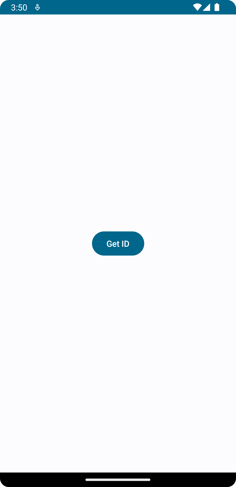
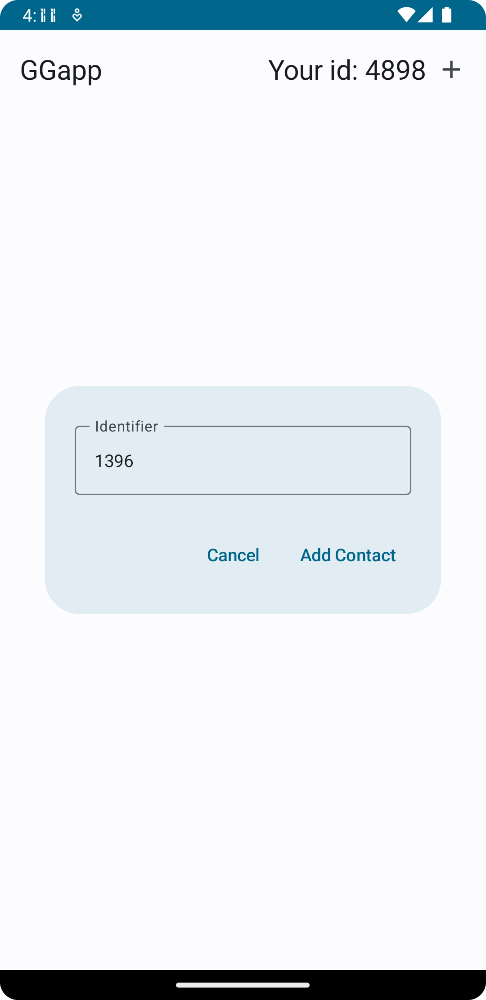
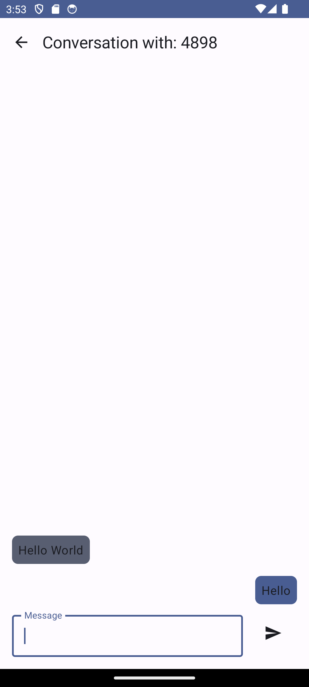

# Text messenger with simple server

## About

Project developed as a culmination of our studies in Computer Networks at the university. This initiative emerged as a comprehensive exploration of networked systems, with a particular focus on mobile applications and server-side functionality. 
 
I took charge of the mobile application, leveraging my skills in Kotlin and Jetpack Compose. Communication with the server takes place at the lowest level using sockets from java.net.Socket. On the server side, we employed C++ as the programming language, utilizing system functions such as BSD sockets for efficient network communication. The codebase was designed with a strong emphasis on concurrency, ensuring smooth and responsive operation. This was achieved through the implementation of input and output multiplexing.

Within our collaborative project, the mobile application serves as a gateway for users to interact with the underlying network infrastructure. One of the key features of the app is the ability for users to obtain a unique individual ID, securely stored on their devices.
Once users have their individual IDs, they can enhance their experience by adding new contacts and initiating conversations with other users.

## Mobile app

<table>
<thead>
<tr>
<td>

</td>
<td>

</td>
<td>

</td>
<td>

</td>
  </tr>
</thead>
</table>